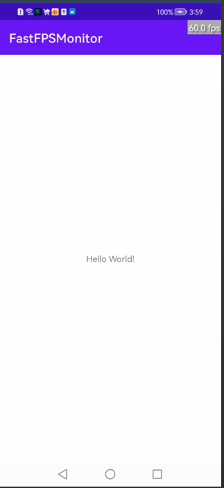

#### FastFPSPlugin
一款FPS监听工具

#### 直接上图



#### 快速使用

在你的主要Activity中打开FPS的开关

> 注意：避免在Application初始化中，因为内部调用了WindowManager.addView()，导致该view存在的生命周期跟Application一样长，这样回到WindowManager.removeView()失效

```kotlin
 FastFpsMonitor.toggle()
```

#### 后期展望

* FPS悬浮窗口拖动

#### License

```
Copyright 2022 MrJiangDong

   Licensed under the Apache License, Version 2.0 (the "License");
   you may not use this file except in compliance with the License.
   You may obtain a copy of the License at

       http://www.apache.org/licenses/LICENSE-2.0

   Unless required by applicable law or agreed to in writing, software
   distributed under the License is distributed on an "AS IS" BASIS,
   WITHOUT WARRANTIES OR CONDITIONS OF ANY KIND, either express or implied.
   See the License for the specific language governing permissions and
   limitations under the License.
```

